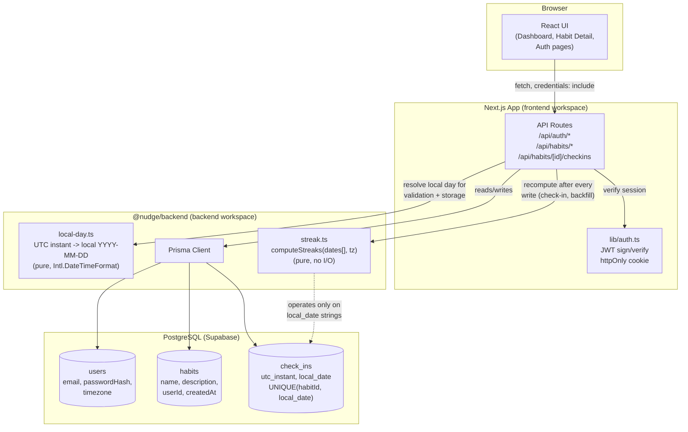

# nudge.io

A full-stack habit tracker with server-computed streaks that are correct in the user's
own timezone — not the server's, not the browser's.

Built with Next.js (App Router), React, TypeScript, Tailwind CSS, Prisma, and PostgreSQL
(hosted on Supabase).

---

## Why this exists

Habit trackers break in one specific, easy-to-miss way: they compute streaks off raw
timestamps or the server's clock, so a check-in near midnight can silently land on the
wrong day for the user, breaking or inflating a streak that should've been unaffected.
The core design decision in this project is to never let that happen — every streak
number is derived strictly from the user's **local calendar day**, computed once on the
server, and the frontend is never trusted to decide whether a streak is alive.

---

## Architecture



**The one rule that matters:** `local-day.ts` and `streak.ts` are pure functions —
no database calls, no HTTP, no side effects. They take a UTC instant (or a list of
local-day strings) and a timezone, and return an answer. That isolation is what makes
them unit-testable in complete confidence, and it's the reason the frontend never needs
to (and never does) recompute a streak — it only ever displays whatever the server
already calculated.

---

## Technical stack

The repository is a monorepo using npm workspaces:

- **`frontend`** — Next.js app. Owns all HTTP routes (`app/api/*`), auth cookie
  handling, and the UI (React context for state, Tailwind for styling, Lucide icons).
- **`backend`** — a reusable workspace package (`@nudge/backend`) exporting the Prisma
  client and the local-day/streak logic. Framework-agnostic on purpose, so the timezone
  math has nothing to do with Next.js and can be tested in complete isolation.
- **Database** — PostgreSQL on Supabase, accessed exclusively through Prisma.

---

## Setup & run instructions

1. **Install dependencies** (from the repo root):
   ```bash
   npm install
   ```

2. **Configure environment variables** — create `backend/.env`:
   ```env
   DATABASE_URL="postgresql://<user>:<password>@<pooler-host>:6543/postgres?pgbouncer=true"
   DIRECT_URL="postgresql://<user>:<password>@<direct-host>:5432/postgres"
   JWT_SECRET="a long random string — e.g. output of `openssl rand -base64 32`"
   ```
   `DATABASE_URL` is the pooled connection (used at runtime); `DIRECT_URL` is the direct
   connection (used only by Prisma migrations).

3. **Run database migrations**:
   ```bash
   npm run prisma:migrate --workspace=backend
   ```

4. **Start the dev server**:
   ```bash
   npm run dev
   ```
   Open [http://localhost:3000](http://localhost:3000).

5. **Run the streak/timezone test suite**:
   ```bash
   npm run test --workspace=backend
   ```

---

## Timezone & local-day logic

### The problem this solves

A user in `America/New_York` checks in at 11:45 PM local time. Stored as a raw UTC
timestamp, that instant is already the next calendar day in UTC. If streak logic ever
compares raw timestamps, or worse, uses the *server's* local clock, that check-in can
land on the wrong day relative to what the user actually experienced — silently
corrupting their streak.

### The solution: local-day as the unit of truth

Every `CheckIn` stores two independent things:

| Field | Purpose |
|---|---|
| `utcInstant` (`utc_instant`) | The exact moment the check-in happened — an audit trail, nothing more. |
| `localDate` (`local_date`) | A `"YYYY-MM-DD"` string: the local calendar day that instant falls on, resolved server-side against the user's stored IANA timezone. |

**`localDate` — never `utcInstant` — is what every streak calculation, duplicate check,
and validation rule operates on.** Once an instant is converted to a local-day string,
all further logic is plain string comparison (`"2026-03-11" < "2026-03-12"`), which is
exact, trivially testable, and immune to DST by construction — there's no clock math
left to get wrong.

This isolation lives in two files, with zero database or HTTP code in either:

- [`backend/src/streak/local-day.ts`](backend/src/streak/local-day.ts) — converts a UTC
  instant + IANA timezone into a local-day string (via `Intl.DateTimeFormat`, so
  timezone/DST rules are handled by the platform, not hand-rolled); also does local-day
  arithmetic (`addDaysToLocalDateString`) and future/past-date validation.
- [`backend/src/streak/streak.ts`](backend/src/streak/streak.ts) — takes a list of
  local-day strings and returns `{ currentStreak, longestStreak }`.

Both are covered by
[`backend/src/streak/streak.test.ts`](backend/src/streak/streak.test.ts) — **12 tests,
all passing**, including the assignment's exact worked example and a real DST
offset-change case.

### Worked example (from the assignment spec)

User in `Asia/Kolkata` (UTC+05:30):

| Check-in | UTC instant | Local day | Result |
|---|---|---|---|
| A | `2026-03-10T14:30:00Z` | `2026-03-10` | streak = 1 |
| B | `2026-03-11T10:30:00Z` | `2026-03-11` | streak = 2 |
| C | `2026-03-11T21:30:00Z` | `2026-03-12` | streak = 3 |
| D | `2026-03-12T17:30:00Z` | `2026-03-12` (same as C) | **duplicate — rejected**, streak stays 3 |

This is reproduced exactly in the test suite, not just described here.

### DST edge case (America/New_York, spring-forward)

DST begins March 8, 2026 at 2:00 AM local time (EST → EDT, UTC-05:00 → UTC-04:00):

- `2026-03-08T06:59:00Z` → `01:59 EST` → local **2026-03-08**
- `2026-03-08T07:01:00Z` → `03:01 EDT` → local **2026-03-08** (offset just changed, day didn't)
- `2026-03-09T04:30:00Z` → `00:30 EDT` → local **2026-03-09**

The conversion is correct through the offset change because `Intl.DateTimeFormat`
resolves the real, current rule for that timezone at that instant — nothing in this
codebase hardcodes an offset.

---

## Database-level defense in depth

Application code rejects a duplicate local-day check-in before it ever reaches the
database — but that alone isn't airtight under concurrent requests (e.g. a double-click,
or two near-simultaneous API calls). So the schema also enforces it directly:

```prisma
model CheckIn {
  id         String   @id @default(uuid())
  habitId    String
  utcInstant DateTime @map("utc_instant")
  localDate  String   @map("local_date")

  @@unique([habitId, localDate])
}
```

If two requests somehow both pass the application-level check, Postgres rejects the
second `INSERT` outright (`P2002` unique constraint violation), which the API layer
catches and turns into a clean `409 Conflict`. The correctness of the one-check-in-per-
local-day rule doesn't depend on the application code being race-free — the database
guarantees it regardless.

---

## What's covered vs. what isn't

**Fully implemented and tested:**
- Email/password auth (bcrypt-hashed passwords, JWT in an httpOnly cookie) with IANA
  timezone captured at signup and validated server-side.
- Habit CRUD, scoped per-user on every query (a user can't read, edit, or check into
  another user's habit — enforced server-side, not just hidden in the UI).
- Check-in for today, or backfill any past local date.
- Full validation stack: reject future dates, reject dates before the habit's creation,
  reject duplicate local-day check-ins (app-level + DB-level).
- Server-computed `currentStreak`/`longestStreak`, recomputed fresh from stored
  check-ins on every read — never cached or stored, so a backfill anywhere in history is
  always reflected correctly, and the frontend never performs streak math itself.
- Responsive UI: dashboard, per-habit detail/history view (calendar + list), backfill
  form, inline error surfacing.

**Deliberately out of scope for this submission:**
- **Timezone-change migration** — changing a user's timezone in settings isn't
  implemented, so there's no need yet to decide how historical check-ins would
  re-bucket under a new timezone. Worth flagging as a real design question if the
  feature were added: existing `local_date` values were computed under the *old*
  timezone and wouldn't be recalculated retroactively without an explicit migration step.
- **Pagination** — habit and check-in history lists are loaded in full. Fine at
  demo scale; would need cursor-based pagination for large history.
- **Docker Compose** — the project runs directly via npm/node against a hosted
  Supabase instance; no containerization was set up.
- **CI pipeline** — no GitHub Actions workflow configured; tests are run locally
  (`npm run test --workspace=backend`).
